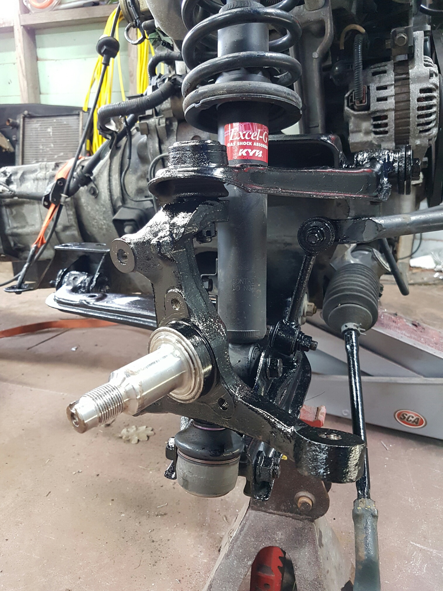
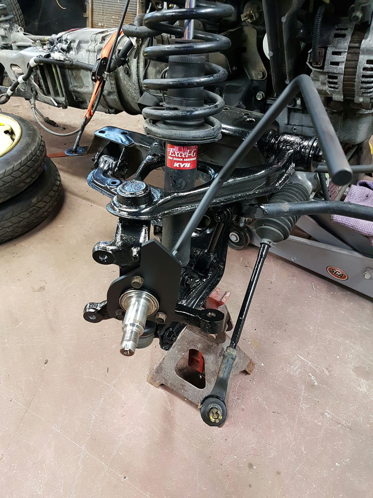

Front Cycle Guards
===
*You can paint the larger piece prior to disassemble.*

1. Jack the car and remove the wheel
2. Remove the brake caliper (14mm + 17mm) bolts. Note the 17mm one wil be replaced by a linged bold in your kit, this one is used on the rear cycle guards.
3. Remove the brake caliper mount (14+17mm bolt)
4. Pop the bearing dust cap off
5. Remove the 28mm(?) nut
6. Remove the rotor
7. 3 bolts to remove the guard pate, these are the mounting points for the front section of the guard.
8. Re-assemble with the front guard mount in place, ensure to use correct torque settings. Leave the 17mm caliper bolt out.
9. With the wheel back on, eye ball a good angle, distance and height from the other bracket/wheel.
10. Punch + Drill for the M10 bolt, you may have to shorten the plate slightly and round a corner to get the angles right.
11. Remove + paint
12. Assemble.
13. Repeat for other side.

**Tip:** The rear part of the guard mount should have the mounting plate on a more horizonal angle than the mount bar itself.

