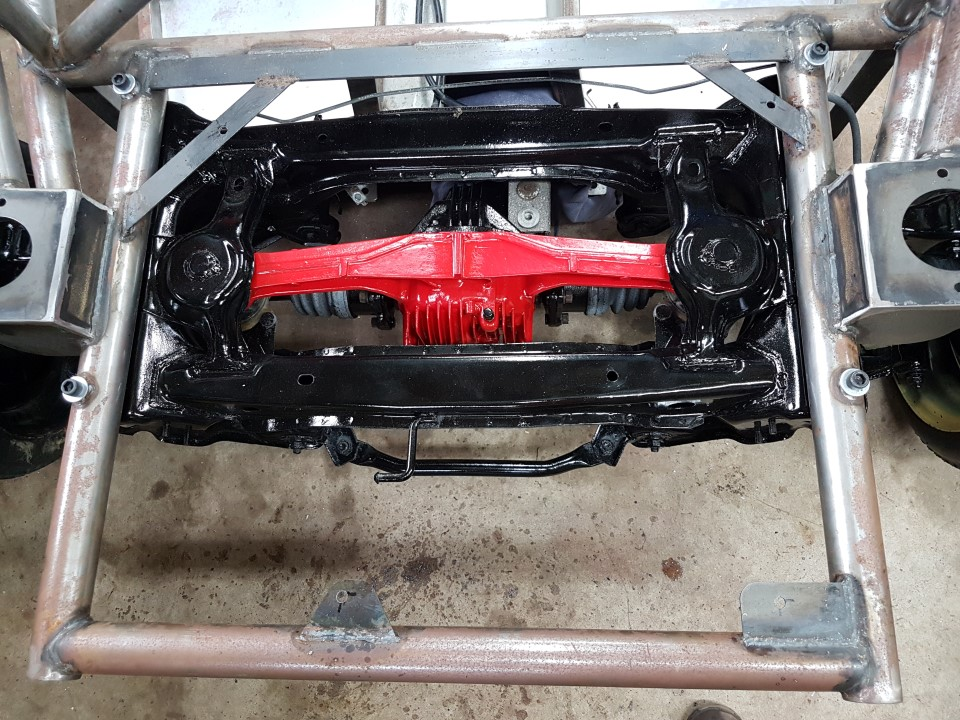

Fuel tank, standard
===

1.	Put the M10x80 bolts with washer through the tank holes, fit the tanks spacers, add a nut and tighten
2.	Place the tank on top of the tank mounts (fuel filler facing to the passenger rear)
3.	Line up the bolts so they are sitting nicely on all plates with sufficient clearance from the edges.
4.	Check the pod fits in place over the tank
5.	Mark the locations of the bolts & remove the tank
6.	Punch and drill the holes.
7.	Remove the nylocs and refit check the bolts line up

