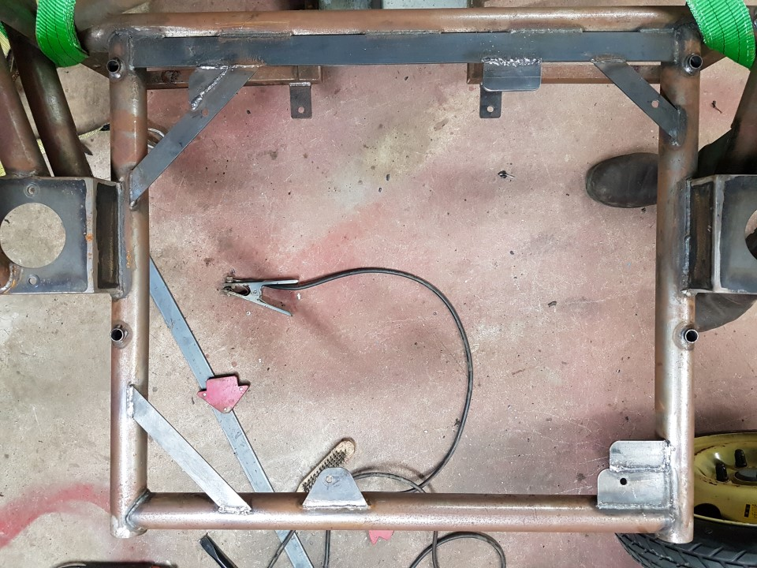
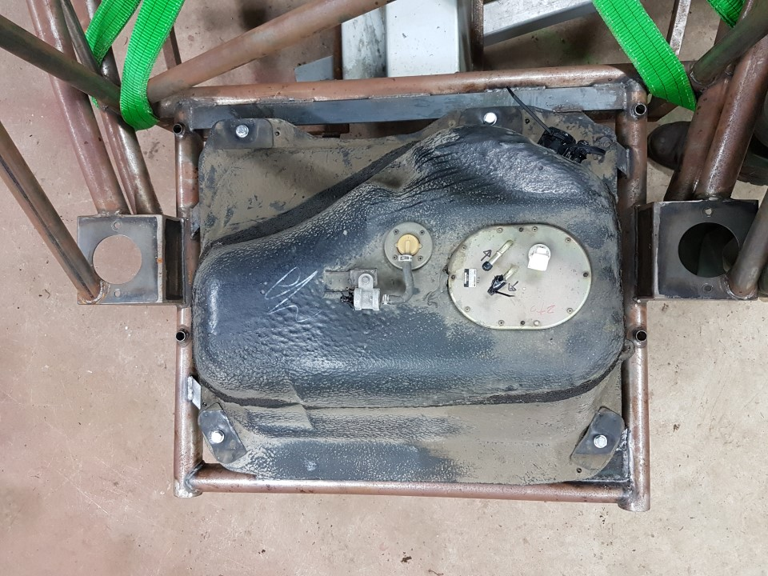

Fuel tank Flip
===

*Optional, we opted to rotate the fuel tank.*

1.	By holding the tank is position round the other way, mark the tube where extra mounting points need to go.
2.	We used a combination of 30x3mm and 40x5mm here, the smaller for the angle piece, and the thicker for joining on the plates.
3.	See images for locations of extra brackets
4.	Test fit the tank, drill holes, use shorter spacers as subframe allows, 40mm should be sufficient.

