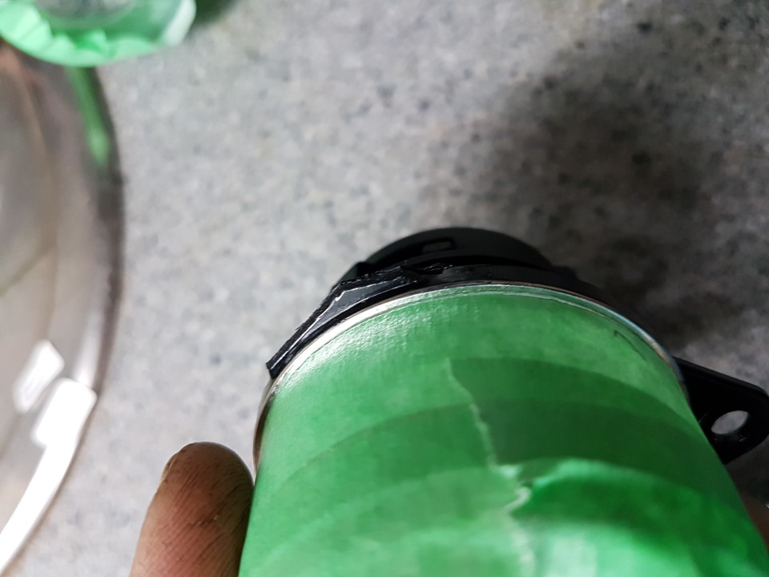
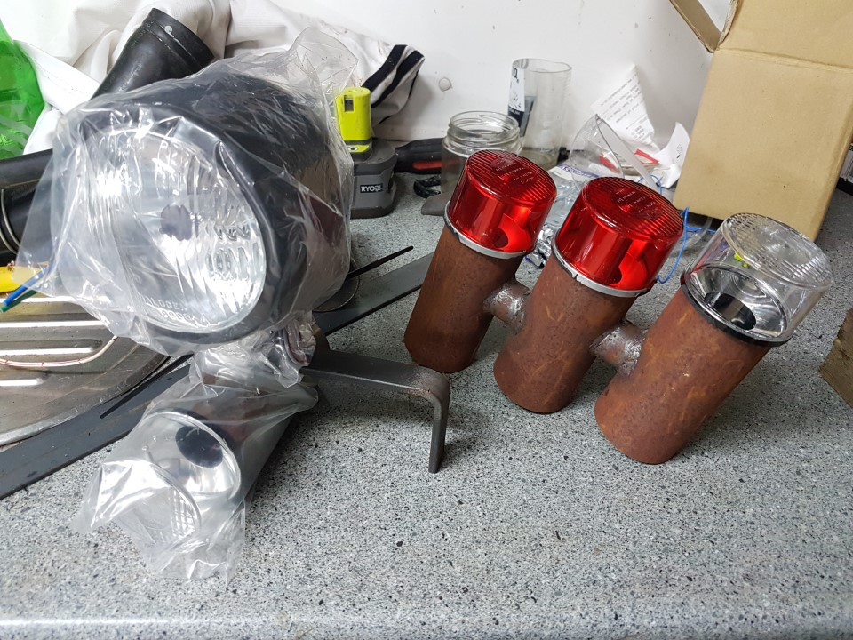

Exocet Pod lights
===
1. Cover the lens in masking tape for protection
2. Cut the mounting hole brackets with side cutters
3. File and sand so the bracket is invisible.
4. Take test fit by sliding the fittings inside the tube assembly. Note they are not symetrical.

###Front
1. Find the headlight bracket (20x5mm L shape) 
2. Drill 10mm hole on the long piece for the headlight bolt.
3. Drill 10mm hole through the single tube (fr indicator)
4. Drill 2x 7mm holes on the short side
5. Follow the 2 holes through the mounting tab on the chassis
6. Drill extra hole for wiring to exit inidcator
7. Paint, and re assemble with the end cap.

##Rear
1. Drill hole on bottom edge wor wiring.
2. Using a short piece of 5x40mm weld the rear pods in place on a angle similar to the pod and so the light lens is 5mm proud of the chassis rail.
3. These will be painted with the rest of the chassis. You could opt to have these removable and paint a different color.
4. When painted assemble with end caps. Dont forget to thread the wires and leave enough slack to pull the lens out to change bulbs. This is a requirement of the cert.

