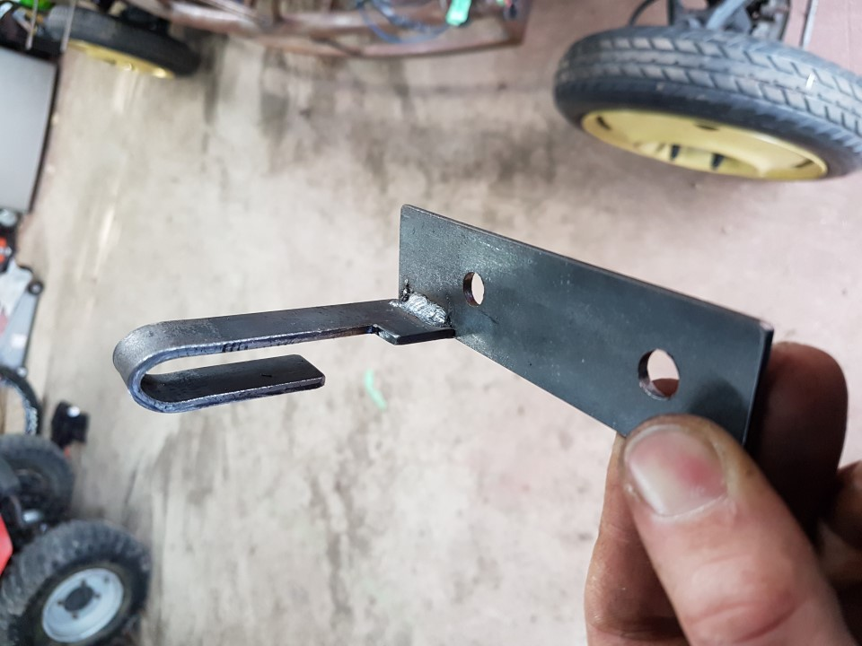
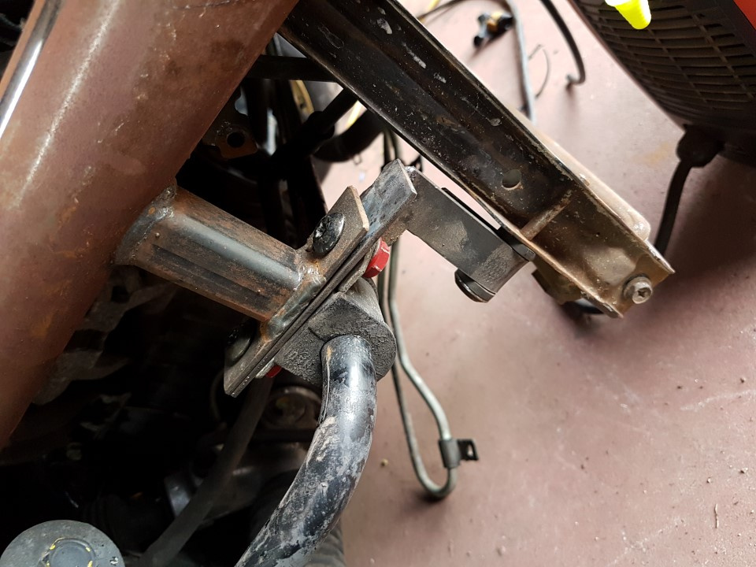

Radiator Mounts
===

If using the standard radiator from the MX5

1. There are 2 bolts welded at the front of the chassis these are the top mounts.
2. The bottoms brackets need to be made, we used 30x3mm mild steel.
3. First we cut a piece to reach from the sway bar mount to the rad & drilled 2 holes to line up with the bolts.
4. cut a 2nd longer peice, with most of its width narrowed to 20mm to accept standard lower rubber mount.
5. Carefully bend into a U shape with a 10mm gap. 
6. Weld this peice to the first at the right length.

