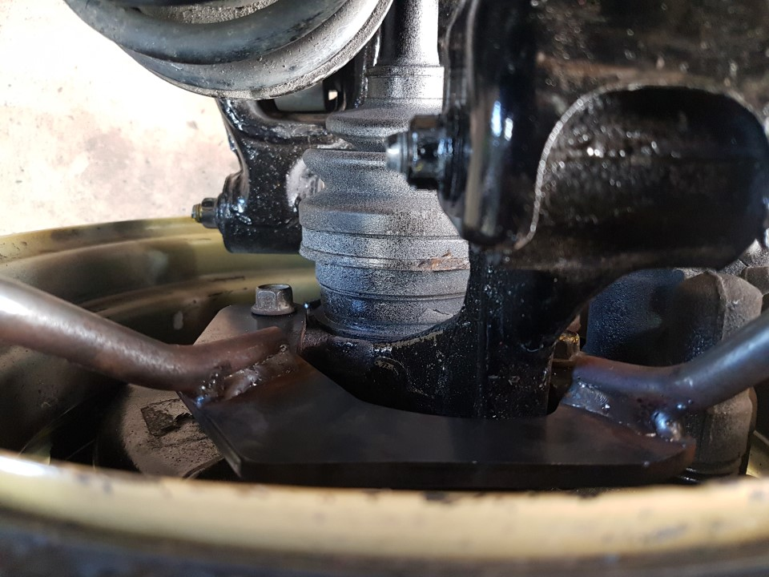
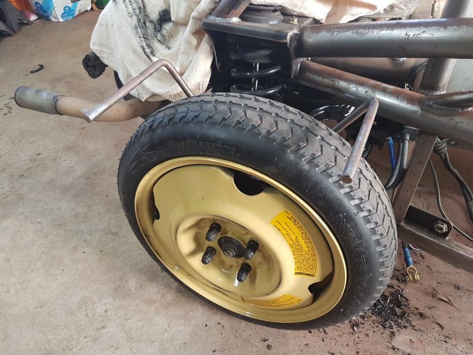

Rear Cycle Guards
===

1. Jack the vehicle up on the diff and support the subframe with axel stands. Note not the wishbones.
2. Remove the drive shaft bolts from the diff
3. Remove the wheel
4. Loose the lower hub-wishbone bolt
5. Remove top hub-wishbone bolt
6. Fold the hub downwards to gain access to behind the wheel.
7. Remove the calipers Note the top bolt can be discarded, this will be replaced with the one fron the front calipers.
8. Towards the rear is a large 'tab', grind flat the cast marking.
9. Fit the bracket to the caliper mount and centralize the rear bolt hole nicely on the tab & mark.
10. Punch and drill the hole 8.8mm is recomended for M10 bolt, we used a 8.5mm.
11. Tap a M10x1.5 thread.
12. Test fit and reassemble.
13. Repeat side 2.

