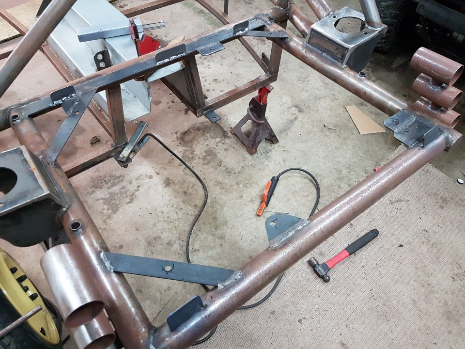
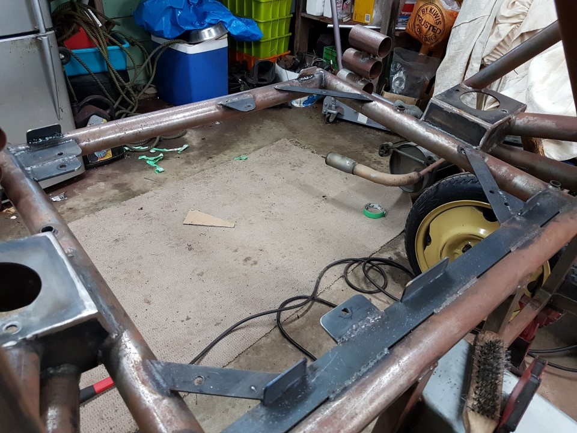
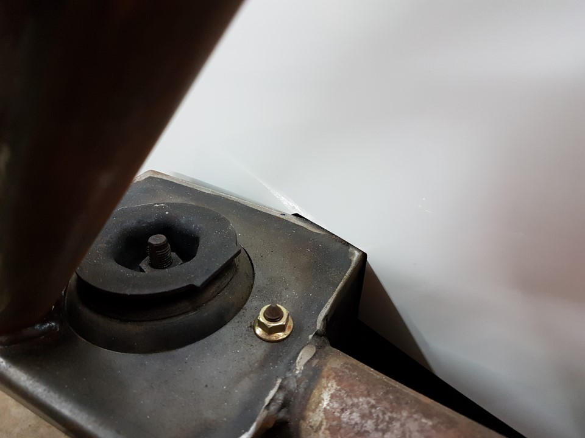
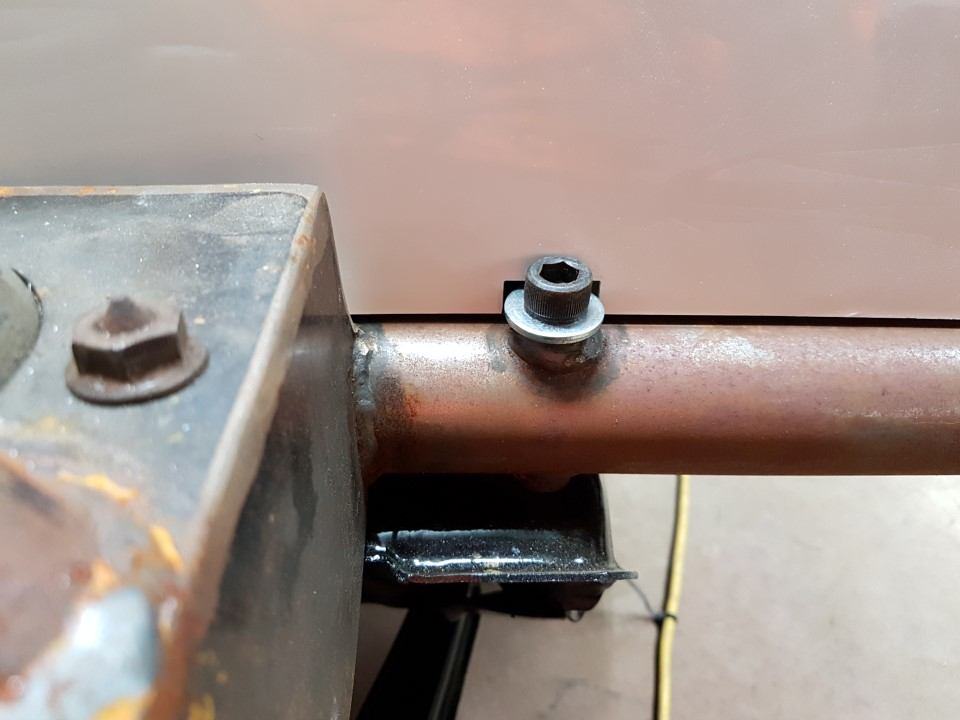
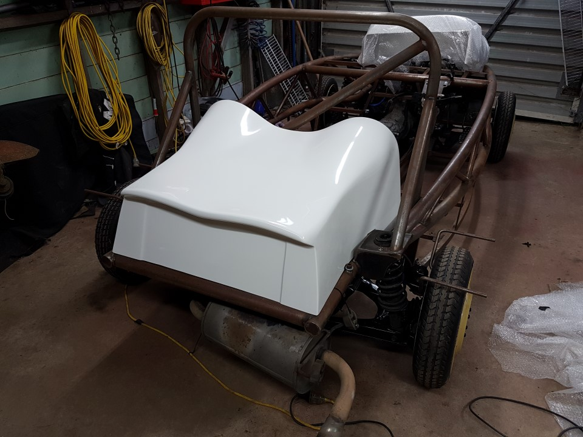

<!doctype html>
<html>
	<head>
		<title>Rear Pod</title>
		<link rel="stylesheet" type="text/css" href="../style/main.css">
	</head>

	<body>
		<article>
			<h1 id="rear-pod">Rear Pod</h1>
			<a href='index.html'>Contents</a> / <a href='#'>Rear Pod</a>
		</article>
		<article>

			<ol>
			<li>Place the rear pod on the back of the chassis so its centered and the back edge runs along the center of the rear tube.</li>
			<li>Mark what needs to be cut out for the suspension struts. In this build it was:  
			180mm back from the front edge, 50mm vertical cut, 30mm horizontal cut, then diagonally to join 260mm from the front edge.</li>
			<li>Cut the lines, use a grinder with a cut off wheel for ceramic to get a clean edge. Take it slow.</li>
			<li>Refit pod, check for adjustments and any other areas of contact.</li>
			<li>In this build we cut out  a 5mm deep 20mm long piece for the rear mounting bolts to ensure sufficient clearance.</li>
			<li>Mounting system, while the pod is in place go under and pop up inside, mark the chassis at the front just inside the pod.</li>
			<li>Remove the pod. </li>
			<li>Cut some steel for the mounting brackets, we used 30x3mm, cut to 60mm long x2 and a center one 100mm long. before attaching we rounded the corners on the top edge to smarten the finish.</li>
			<li>Weld these on the 5x40mm flat bar at suitable points. We had the 60mm pieces aiming to be behind the seats to hide the bolts. The center one is more of a backup encase we need it, and providing a mounting point for fuel pipes later.</li>
			<li>Let cool and refit the pod. </li>
			<li>Mark the rear edge of the pod on the rear tube (once again, from the inside. </li>
			<li>Remove pod, cut a card template for the angle these rear brackets need to be.</li>
			<li>Hold the bracket on the tube on your line at the correct angle and weld. Note, this is 1.6mm tube wall, dont overheat it!</li>
			<li>Repeat for the other side, making sure this one is equal distance in as per the previous.</li>
			</ol>

			
  
			  
			  
			  
			

			

		</article>
	</body>
</html>
