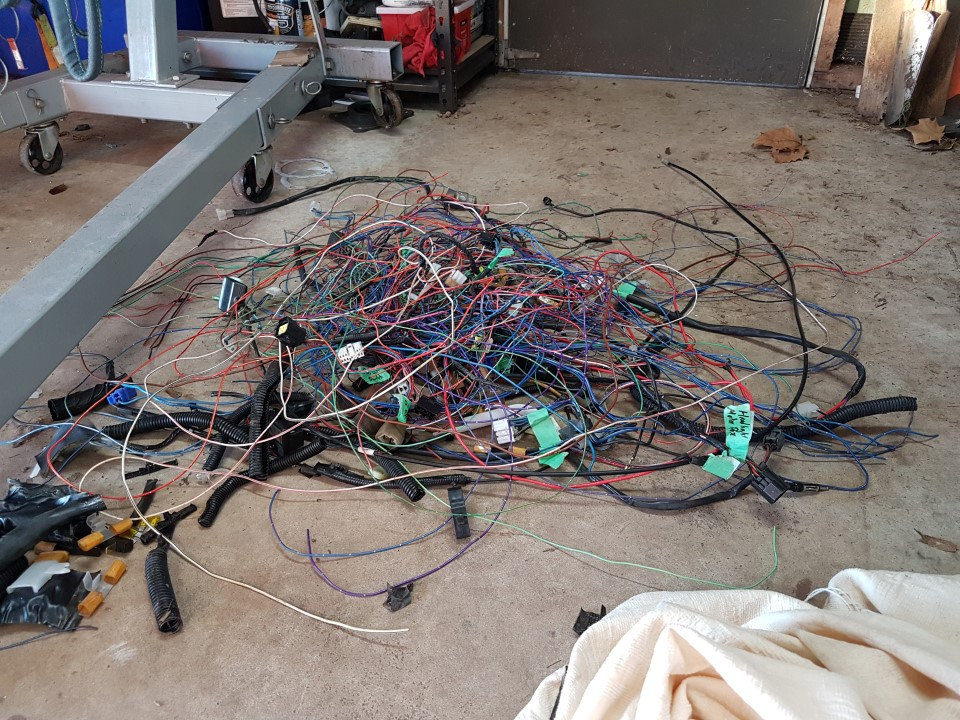
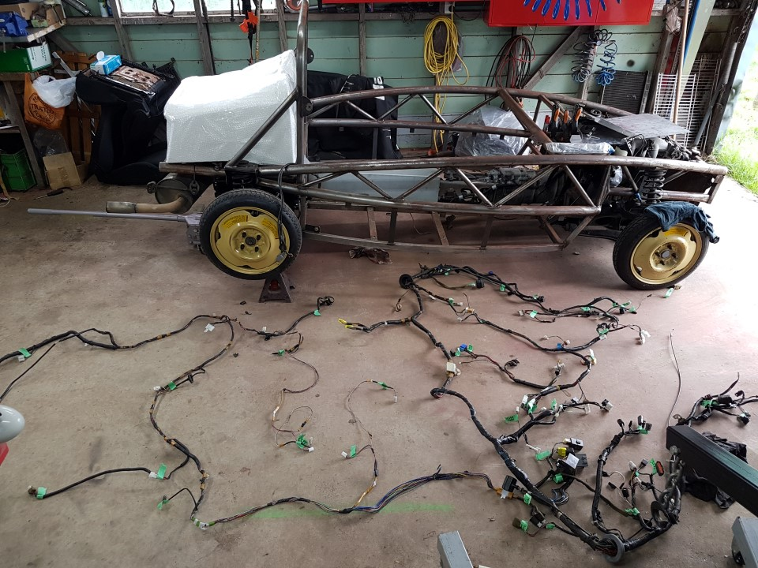

Strip MX5 wiring
===
The MX5 has plenty of wires that are not needed, it makes sense to remove these rather than carry them around doing nothing.
 - Radio & speakers
 - Heater & AC
 - Seatbelt sensors
 - Heated rear screen
 - Power headlights
 

